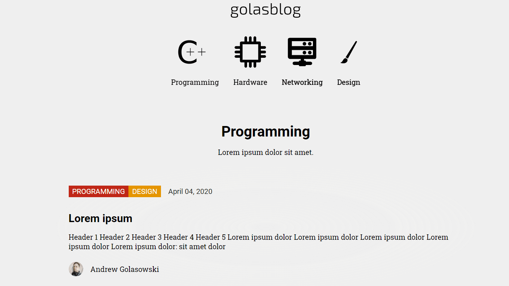
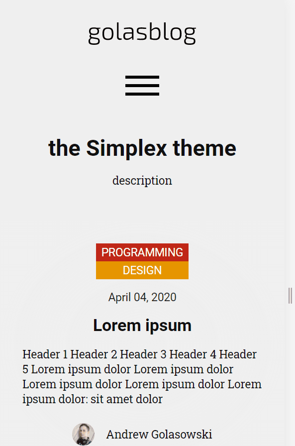
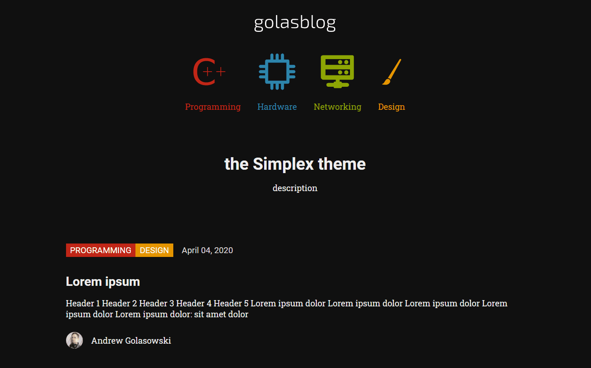
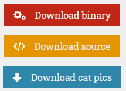

⚠ WORK IN PROGRESS - DO NOT USE IN PRODUCTION ⚠

[](https://golas.blog/)

# 

A *simple* yet neat blogging theme. Developed for the [golas blog](https://golas.blog/) project.

## 👓 Preview


## 💎 Features
### Responsive


### Dark mode


### Buttons


### Lity Lightbox 
Supports images, videos, iFrames and more. See below for syntax.

## ℹ Installation

Add this line to your Jekyll site's `Gemfile`:

```ruby
gem "jekyll-theme-simplex"
```

And add this line to your Jekyll site's `_config.yml`:

```yaml
theme: jekyll-theme-simplex
```

And then execute:

    $ bundle

Or install it yourself as:

    $ gem install jekyll-theme-simplex

## ✔ Usage

### ⚙ Setting up the template
Replace the contents of the _config.yml file with the following:
```yaml
title: the Simplex theme #The name of your blog.
logo_img: /assets/img/icons/golasblog_logo.svg #Absolute path to the logo. If not specified, the title will be displayed instead.
description: description #Description.
global_tags: jekyll theme simplex golasblog responsive html5 #Tags.
copyright: © Golasowski 2020 #Your copyright.

collections:
    category:
        output: true
    authors:
        output: false

defaults:
  -
    scope:
      path: ""
      type: category
    values:
      layout: "category"
```

### ✨ Defining categories
Create a `_category` folder in the root directory of the blog. Create a `.md` file for every category with the contents:
```
---
category: [design] #Category ID.
hue: var(--c-themeHueOrange) #Category hue. See note [1].
title: Design #Category title.
description: Lorem ipsum dolor sit amet.
---
```

### 🤵 Defining authors
Create a `_authors` folder in the root directory. Create a `.md` file for every author with the contents:
```
---
nick: golas #Author's nick.
full_name: Andrew Golasowski #Author's full name.
photo_dir: assets/img/authors/golas.png #Path to the author's pic.
---
```

### 📰 Defining the menu
Create a `_data` folder in the root directory. In the folder, create a `nav.yaml` file. Here's an example:
```yaml
- title: Programming #Menu item title.
  url: category/programming.html #Menu item url.
  icon: assets/img/icons/programming.svg #Menu item icon.
  hue: "var(--c-themeHueRed)" #Menu item hue - see note [1].
  subnav: #Subnav. See note [2].
      - title: C++ #Submenu item title.
        url: cpp.html #Submenu item url.
        hue: "var(--c-themeHueOrange)" #Submenu item hue.
        subnav: #Another subnav
            - title: Libraries
              url: libs.html
              hue: "var(--c-themeHueBlue)"
- title: Design
  url: design.html
  icon: assets/img/icons/design.svg
  hue: "var(--c-themeHueRed)"
```
#### Pro tip:
Use color icons with the same hue as the menu items. Icons will be black and on hover the color will be shown.

### ✒ Creating posts
Posts are created in the `_posts` directory. Following front matter attributes are supported:
```
---
layout: post #Do not change.
category: [programming, testing] #One, more categories or no at all.
title: "Lorem ipsum" #Article title.
author: andy #Author's nick.
---
Your markdown content here.
```

### ⚡ Syntax highlighting
The theme uses Pygments CSS created by [@richleland](https://github.com/richleland). If you want to modify the highlighting styles, just download different CSS or create your own - see [Jekyll docs](https://jekyllrb.com/docs/liquid/tags/#stylesheets-for-syntax-highlighting).

Note - `@media` is used to manage different styles for light and dark web browser mode. See `_variables.scss` file for details.

### 📷 Inserting pictures
Classic Markdown syntax is supported. However, to be able to use the lightbox feature, you have to use HTML syntax. Minimal example:
```html
<a href="/assets/example.jpg" data-lity>
  
</a>
```

To provide image description use this syntax:
```html
<div class="sx-picture">
  <a href="/assets/example.jpg" data-lity>
    
  </a>
  <span class="sx-subtitle">My picture description.</span>
</div>
```

**Do not forget the `data-lity` attribute.**

#### ↔ Centering
To center pictures, put the code inside a `div` with `sx-center` class like this:
```html
<div markdown=1 class="sx-center">
  
</div>
```

### 🔘 Buttons
Buttons can be inserted with the following syntax. Just replace `theme` with `red`, `green`, `blue`, `orange`, `purple` or `brown`, specify the target link in `href` attribute and the icon in `src` attribute.
```html
<div class='sx-button'>
  <a href='https://your.link.here.example.com/' class='sx-button__content theme'>
    #{text}
  </a>
</div>
```

Markdown attribute can be omitted if you don't use markdown inside the block (e.g. by using the lightbox syntax).

### ℹ Notes
[1] Hue can be either one of the predefined colors or any of the CSS `color` attribute supported values (hex, rgb...).

[2] Submenus are generated recursively, so any menu (and submenu) can have its own submenu.

#### Predefined colors
You can use following predefined colors:
```scss
--c-themePrimaryLight: #EFEFEF;
--c-themePrimaryDark:  #101010;
--c-themeSecondaryLight: #DADADA;
--c-themeSecondaryDark: #252525;
--c-themeTerniaryLight: #AEAEAE;
--c-themeTerniaryDark: #515151;
--c-themeQuaternaryLight: #919191;
--c-themeQuaternaryDark: #888888;

--c-themeHueRed: #C02717;
--c-themeHueGreen: #8EA604;
--c-themeHueBlue: #2E86AB;
--c-themeHueOrange: #E59500;
--c-themeHuePurple: #9F00CE;
--c-themeHueBrown: #230007;
```
These colors are CSS variables, usage: `var(--var-name)`

## Add-ons
Add-ons are distributed as Jekyll plugins. Just download any desired `.rb` file from the repository `_plugin` folder and put it in your `_plugin` folder.

### Buttons (button.rb)
Adds a tag to simplify insertion of buttons:
```

Download binary

```

## 🤝 Contributing
 
Bug reports and pull requests are welcome on [GitHub](https://github.com/andreondra/jekyll-theme-simplex).

## ⚙ Development

To set up your environment to develop this theme, run `bundle install`.

Your theme is setup just like a normal Jekyll site! To test your theme, run `bundle exec jekyll serve` and open your browser at `http://localhost:4000`. This starts a Jekyll server using your theme. Add pages, documents, data, etc. like normal to test your theme's contents. As you make modifications to your theme and to your content, your site will regenerate and you should see the changes in the browser after a refresh, just like normal.

When your theme is released, only the files in `_layouts`, `_includes`, `_sass` and `assets` tracked with Git will be bundled.
To add a custom directory to your theme-gem, please edit the regexp in `jekyll-theme-simplex.gemspec` accordingly.

## Credits
Includes icons by [uxwing](https://uxwing.com/).

The lightbox feature is provided by [Lity](https://github.com/jsor/lity) licensed under the [MIT License](https://opensource.org/licenses/MIT).

Uses [jQuery](https://github.com/jquery/jquery) JavaScript plugin licensed under the [MIT License](https://opensource.org/licenses/MIT).

## ⚖ License
© Ondrej Golasowski. The theme is available as open source under the terms of the [MIT License](https://opensource.org/licenses/MIT).

